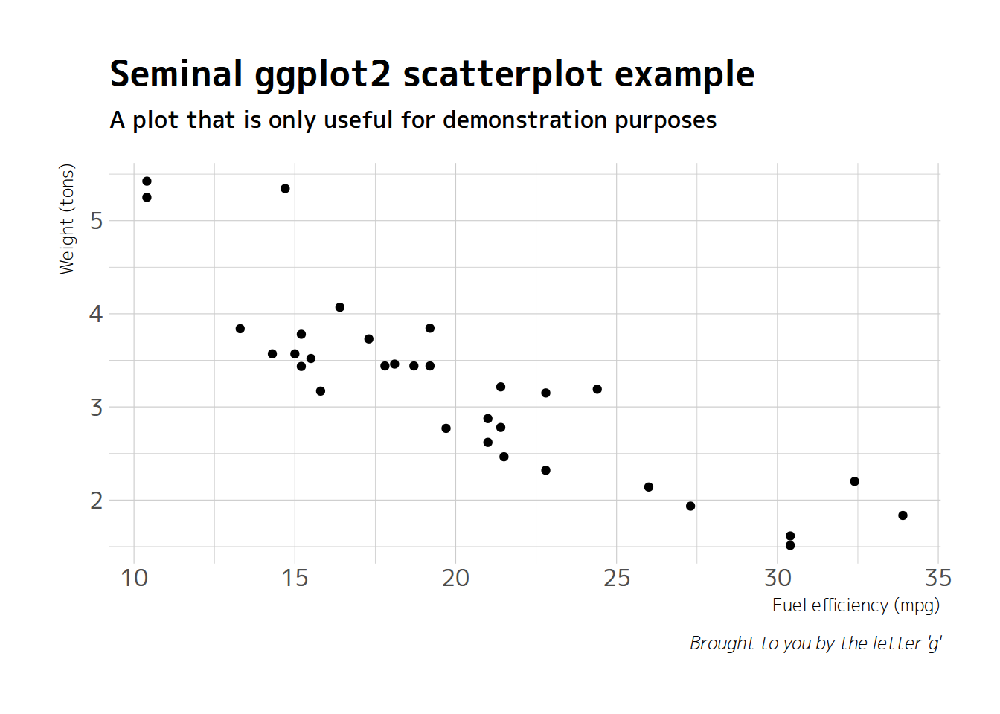
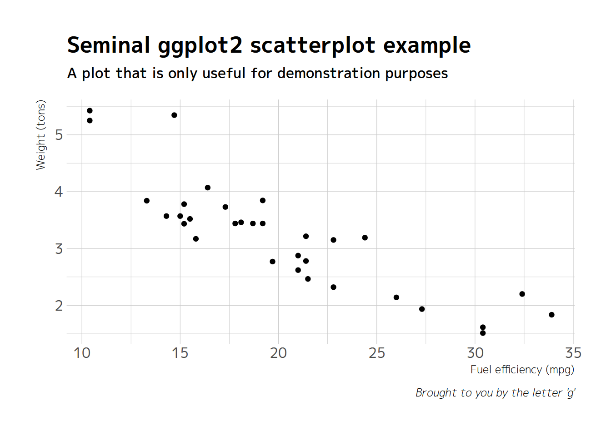
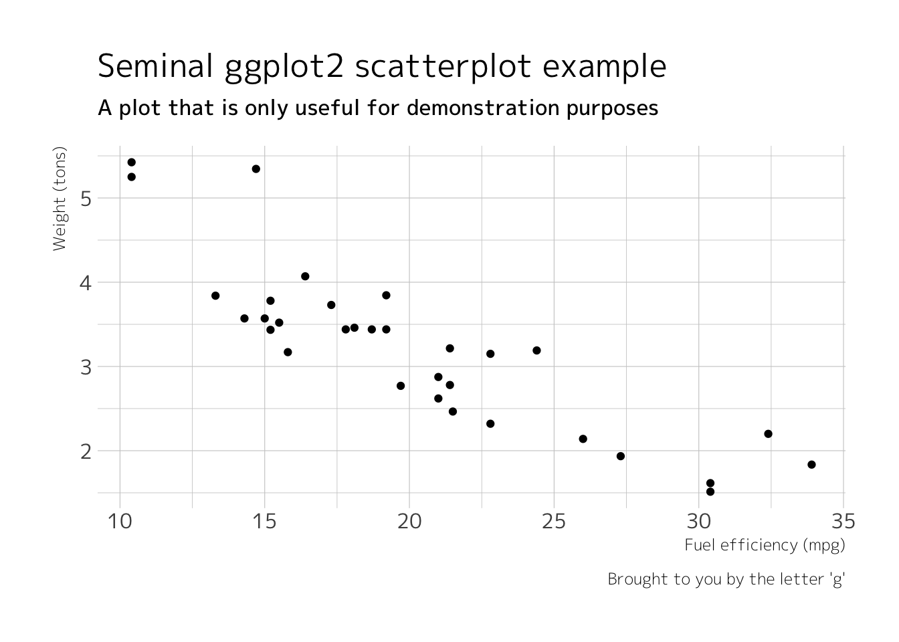
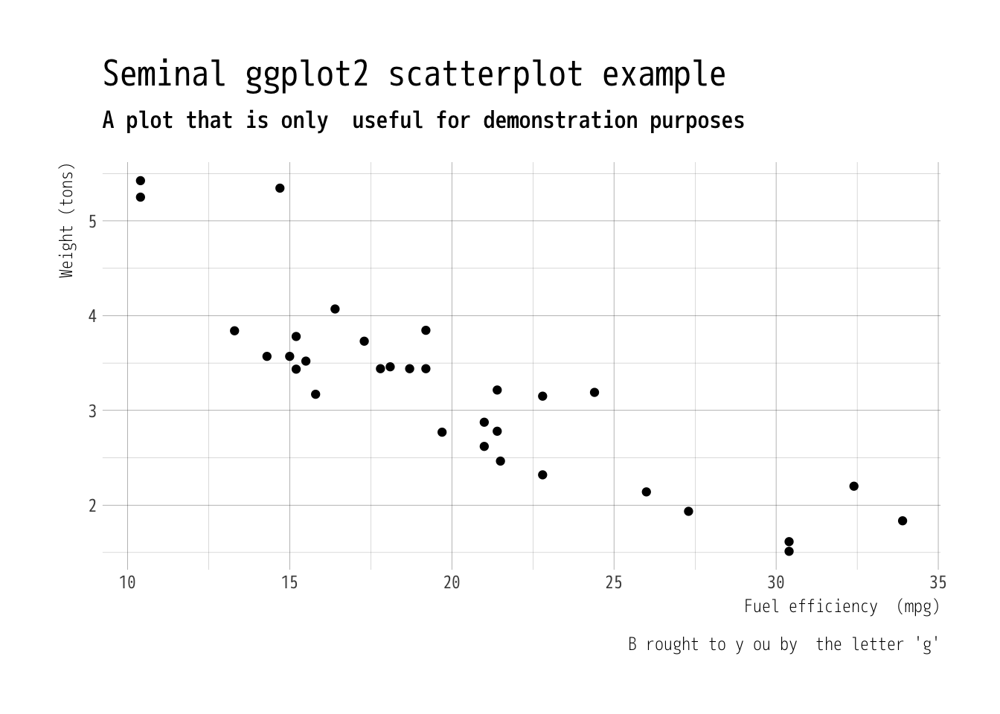

M+ FONTS Based `ggplot2` Themes.
--------------------------------

[](http://www.repostatus.org/#active) [](/commits/master)

[](https://travis-ci.org/bhaskarvk/fontMPlus) [](https://ci.appveyor.com/project/bhaskarvk/fontMPlus)

[](https://opensource.org/licenses/MIT)

[](https://cran.r-project.org/) [](https://cran.r-project.org/package=fontMPlus) [](commits/master)

------------------------------------------------------------------------

This is an add-on pacakge for [hrbrthemes](https://github.com/hrbrmstr/hrbrthemes) pacakge. It provides seven ggplot2 themes based on [M+ FONTS](http://mplus-fonts.osdn.jp/about-en.html).

The M+ fonts are a font family under the Free license. You can use, copy, and distribute them, with or without modification, either commercially or noncommercially. The font family provides multilingual glyphs. The fonts provide Kana, over 5,000 Kanji, Basic Latin, Latin-1 Supplement, Latin Extended-A, and IPA Extensions glyphs. Most of the Greek, Cyrillic, Vietnamese, and extended glyphs and symbols are included too. So the fonts are in conformity with ISO-8859-1, 2, 3, 4, 5, 7, 9, 10, 13, 14, 15, 16, Windows-1252, T1, and VISCII encoding.

In order to keep the R package size under 5MB, which is a CRAN requirement, we include only the basic Latin glyphs with R package. But you can clone this repo and use complete glyph set as described in the documentation of `import_mplus()` function.

The package is released under MIT License while the M+ fonts are released under a [license](http://mplus-fonts.osdn.jp/about-en.html#license) that permits free usage, distribution, modification both commercially and non-commercially.

### Installation

``` r
install.packages('hrbrthemes')

if(!require(devtools)) {
  install.packages("devtools")
}
devtools::install_github('bhaskarvk/fontMPlus')


# Required only once to import basic latin glpyh fonts included with this package.
fontMPlus::import_mplus()

# To import complete glyph set including Kana/Kanji glyphs use one of the two approaches below.
# NOTE: You don't need to do this if you don't need Kana/Kanji glyphs.

# Download and extract https://osdn.net/projects/mplus-fonts/downloads/62344/mplus-TESTFLIGHT-062.tar.xz/ to some directory.
fontMPlus::import_mplus(font_dir='directory containing M+ fonts')

# OR

# git clone this repo.
# cd fontMPlus (where fontMPlus is the directory where you have cloned this repo)
fontMPlus::import_mplus(font_dir='data-raw/complete-glpyhs')
```

The `fontMPlus::import_mplus()` call will import the M+ fonts in your `extrafont` database. You will then need to install the M+ fonts in the directory mentioned in the output of that call as per your operating system's way of installing fonts.

### Usage

#### M+ C Type 1

``` r
library(ggplot2)
library(fontMPlus)

gg <- ggplot(mtcars, aes(mpg, wt)) +
  geom_point() +
  labs(x="Fuel efficiency (mpg)", y="Weight (tons)",
       title="Seminal ggplot2 scatterplot example",
       subtitle="A plot that is only useful for demonstration purposes",
       caption="Brought to you by the letter 'g'")

gg + theme_ipsum_mplus_c1()
```



#### M+ C Type 2

``` r
gg + theme_ipsum_mplus_c2()
```


#### M+ P Type 1

``` r
gg + theme_ipsum_mplus_p1()
```



#### M+ P Type 2

``` r
gg + theme_ipsum_mplus_p2()
```



#### M+ M Type 1

``` r
gg + theme_ipsum_mplus_m1()
```


#### M+ M Type 2

``` r
gg + theme_ipsum_mplus_m2()
```



#### M+ MN Type 1

``` r
gg + theme_ipsum_mplus_mn1()
```


### Code of Conduct

Please note that this project is released with a [Contributor Code of Conduct](CONDUCT.md). By participating in this project you agree to abide by its terms.
